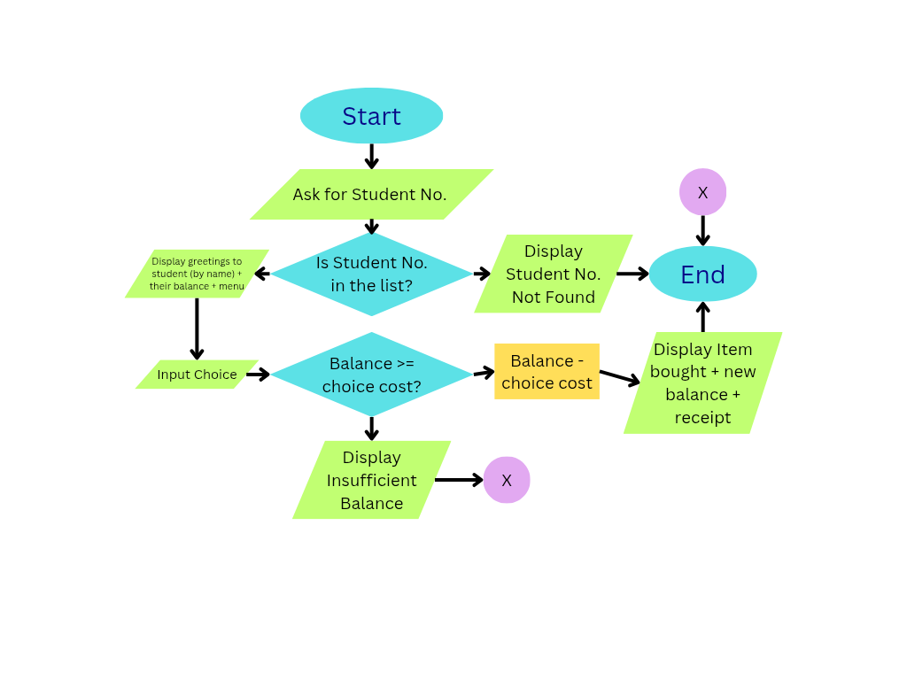

## Project Title
Canteen Self-Checkout

## Project Description
This is a simple Python program that simulates a self-checkout in the school canteen.  
It shows a menu of food items with prices, allows a student to enter their student number, deducts the cost of the chosen item from their balance, and displays the purchase and the new balance.

## Features
- Enter student numbers and automatically match student names.
- Show a menu of food items and their prices.
- Deduct the cost from the student’s balance.
- Display the new balance after purchase.
- (Draft only) Uses lists for data storage.
- (Draft only) **No real security** – anyone with a student number can make a purchase.

## How to Run the Program
1. Make sure you have Python installed.
2. Download the file `canteen_checkout.py`.
3. Open a terminal or command prompt.
4. Run the program by typing `python canteen_checkout.py`.
5. Follow the on-screen instructions to enter a student number and choose an item.

## Example Output

Enter Student Number: 2023-0001

Welcome Dela Cruz, Juan! Balance: ₱150.0

Menu
1. Burger ₱35.0
2. Fries ₱30.0
3. Hotdog ₱25.0
4. Juice ₱20.0

Choose item number: 1

Bought Burger

New balance: ₱115.0

## Flowchart

## Contributors
- Student 1: Rheian Jay G. Negad (input validation, user interface)
- Student 2: Elvin Jerald U. Lim (menu logic and balance deduction)
