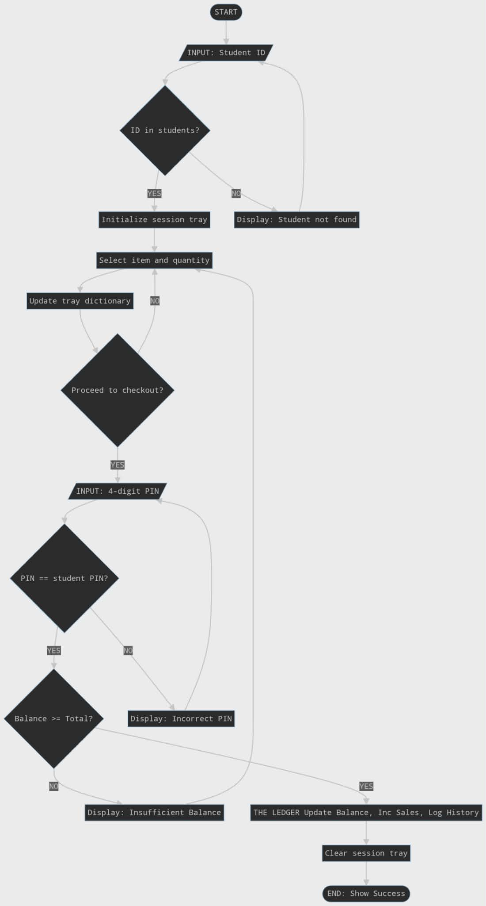

# Canteen Self-Checkout
## Project Description
This web application automates school canteen transactions. Students select food, manage a virtual tray, and pay via a secure PIN. The system manages student balances and tracks total sales.
## Features
### Security and Access
 * Students log in with a Student ID.
 * Administrators access the system via a master PIN.
 * The system requires a four digit PIN for every payment.
 * Three failed PIN attempts trigger an automatic logout.
### Student Experience
 * The menu displays food items and current prices.
 * The tray allows users to add or subtract item quantities.
 * A custom keypad facilitates secure PIN entry.
### Administrative Tools
 * The dashboard shows total revenue and quantities sold.
 * Administrators add new items and set prices through the panel.
 * The system maintains a log of every successful transaction.
 * An export function generates a text report with sales data and session runtime.
## Technical Stack
 * Python handles backend logic with the Flask framework.
 * HTML and CSS provide the user interface.
 * JavaScript manages the keypad and modal interactions.
## How to Run the Program
 1. Install Python on your system.
 2. Install Flask using pip install flask.
 3. Run the application with python app.py.
 4. Access the interface at http://127.0.0.1:5000 in a browser.
## System Credentials
 * Student ID 2023 0001 uses PIN 1111.
 * Student ID 2023 0002 uses PIN 2222.
 * The Admin Panel uses PIN 1234.
## Flowchart Logic
 1. Login. Authenticate as a student or administrator.
 2. Menu. Select food items.
 3. Tray. Review the total and adjust quantities.
 4. Payment. Enter the account PIN.
 5. Success. The system deducts the total from the student balance.
 
## Contributors
 * Rheian Jay G. Negad. Interface design and input validation.
 * Elvin Jerald U. Lim. Backend architecture and reporting logic.
